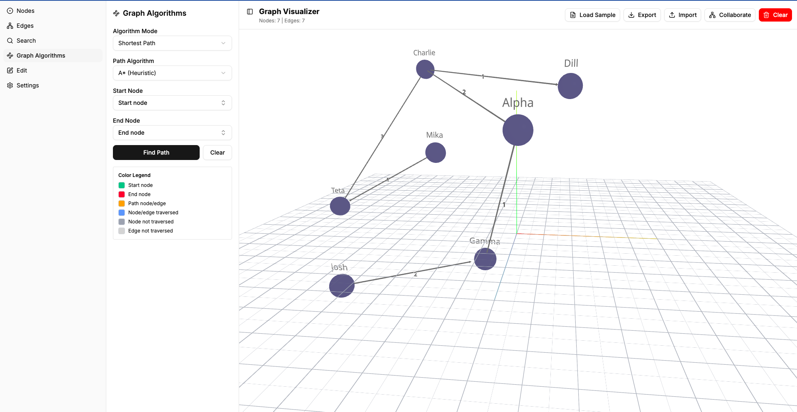

# Interactive 3D Graph Editor

This project is an app that allows a user visually manage a graph — adding/removing nodes and edges, searching for nodes,
and saving/loading the graph for later use.

## Description

Create, edit and remove nodes and edges. Search for nodes and edges. Support for directed and wighted graphs. Run pathfinding algorithms and visualise all the nodes and edges trasversed and the path for node and source destination. Configure how your editor looks: change colors of nodes, edges and labels and edge thickness. Collaborate in real-time with other users. Export your graph data or import new data. Load samples of data to try the algorithms.



## Getting started

### Dependencies
This projects relies on [React 19](https://react.dev/blog/2024/12/05/react-19), [Vite](https://vite.dev/), [Tailwind CSS](https://tailwindcss.com/), [Shadcn](https://ui.shadcn.com/) and [Three.js](https://threejs.org/) for it's core functionality on the frontend. The backend is based on [Node.js](https://nodejs.org/), and [ws](https://www.npmjs.com/package/ws) for websocket. Both were written using [Tyepscript](https://www.typescriptlang.org/).


### Installing

#### Frontend
For installing the frontend dependencies, first you need to enter the frontend folder from the root of the project:

```
cd frontend
```

Once you are on the frontend project, to install the dependencies you run:

```
npm install
```

After the installation succeds you can run the project:

```
npm run dev
```

#### Backend
For installing the frontend dependencies, first you need to enter the backend folder from the root of the project:

```
cd backend
```

Once you are on the backend project, to install the dependencies you run:

```
npm install
```

If you you want your backend in dev mode you use the dev script:

```
npm run dev
```

This way any changes you make on the backend file will be live instantly. Otherwise you can build your project and run the build version.

To build the backend project you just run:


```
npm run build
```

To run the built version you run this script:

```
npm run start
```

## Graph Representation Rationale
In order to represent the graph structure, instead of using an Adjacency List or an Adjacency Matrix, I decided to use an hybrid model consisting of
a Node List (or array/map of node objects) and an Edge List (or array/map of edge objects).

```
const graphState = {
  nodes: [
    { id: 'n1', label: 'Node A', position: { x: 100, y: 100, z: 100 } },
    // ...
  ],
  edges: [
    { id: 'e1', source: 'n1', target: 'n2' },
    // ...
  ]
};
```

### Why Node/Edge Lists are Excellent for the UI/Frontend?
**UI Integration:** The core idea is building a Single-Page Web Application (SPA) that lets users visually manage the graph. Frontend visualization libraries (like React Flow or D3.js) are almost universally optimized to consume data in this format: a separate list of objects for nodes and edges.

**Storing Metadata:** This structure allows you to easily attach rich metadata essential for the UI, which a standard Adjacency Matrix or pure Adjacency List cannot store as neatly:

* **Node Object:** Stores visual coordinates (e.g., _position: {x, y}_), labels, and potentially UI state (e.g., isSelected).

* **Edge Object:** Stores visual characteristics or weights (if using weighted graphs).

**Simplicity for CRUD (Create, Read, Update, Delete):** Adding/removing a node or edge simply means pushing/splicing an object in one of two flat arrays, which is simple for state management libraries (like Redux or Zustand) to track.

### Trade-offs of the data structure
While the Node/Edge List is great for the UI, it's often inefficient for pure algorithm execution (like pathfinding, traversals, or cycle detection).

For future implementation, when a user runs a graph algorithm (like BFS or Dijkstra's), it could be pre-processed or derived a classical Adjacency List to ensure the algorithm runs with the most efficient _O(|V| + |E|)_ complexity.

# Real-time Collaboration

## Backend Setup

### 1. Dependencies

- Built with `express` and `ws`
- CORS support with `cors` and `@types/cors`

### 2. Backend Structure

- `src/index.ts` - Main server entry point
- `src/types/graph.ts` - Shared TypeScript types for GraphNode and GraphEdge (matching frontend)
- `src/server.ts` - Express server setup
- `src/websocket.ts` - WebSocket server and state management

### 3. Shared State Management

- In-memory shared state store containing `nodes` and `edges` arrays
- Connected clients tracking
- When first client connects: initialize shared state with their graph state
- When subsequent clients connect: conflict-free merging with [Y.js](https://yjs.dev/) along with all updates
- Broadcast state changes to all connected clients (except sender)

### 4. WebSocket Message Protocol

- `JOIN` - Client connects, sends their current state
- `STATE_SYNC` - Server sends current shared state to new client
- `NODE_ADD` - Add node operation
- `NODE_UPDATE` - Update node operation  
- `NODE_REMOVE` - Remove node operation
- `EDGE_ADD` - Add edge operation
- `EDGE_UPDATE` - Update edge operation
- `EDGE_REMOVE` - Remove edge operation
- `FULL_STATE` - Full state update (for initial sync)

## Frontend Setup

### 1. WebSocket Client Hook

- WebSocket client utilities - `src/lib/collaboration.ts`
- React hook for managing collaboration state - `src/hooks/use-collaboration.ts`
- Handle connection, disconnection, sending/receiving messages
- Integrate with Redux to dispatch actions on remote changes

### 2. Redux Integration

- ListenerMiddleware to intercept Redux actions for nodes/edges
- When collaboration is active:
- Send local changes (add/update/remove node/edge) to server via WebSocket
- Apply remote changes received from server to local Redux store
- Only sync nodes and edges (ignore selections, pathfinding results, settings)

### 3. State Synchronization Logic

- On collaboration start: send current nodes/edges to server
- On collaboration stop: disconnect WebSocket, continue local-only mode
- Handle incoming updates: merge remote changes into shared state using [Y.js](https://yjs.dev/)
- Simple conflict resolution: last write wins (server broadcasts to all)